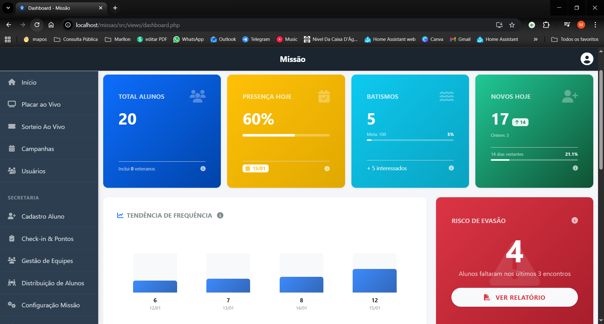
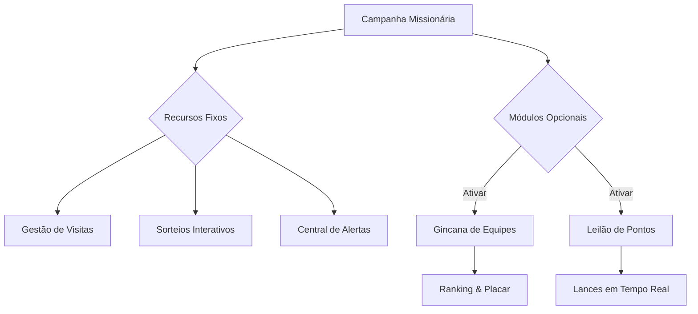
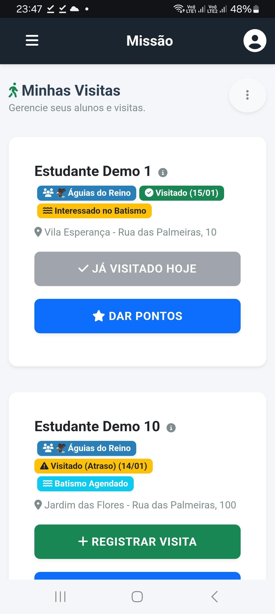
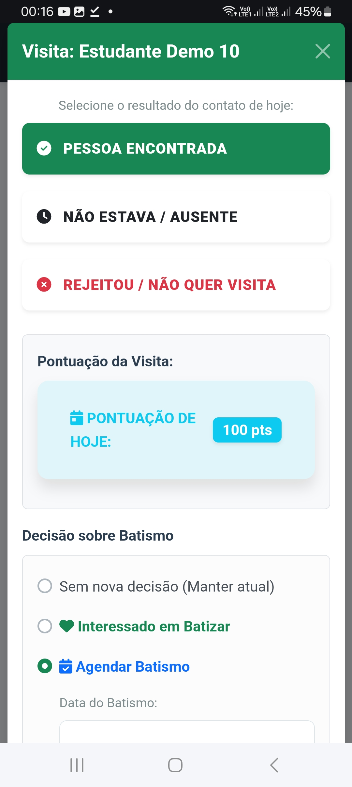
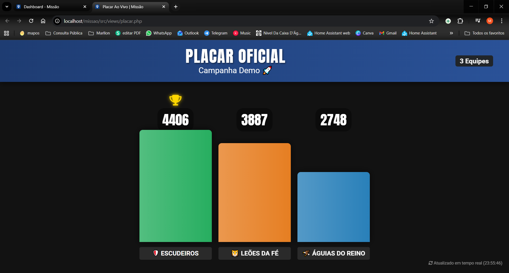
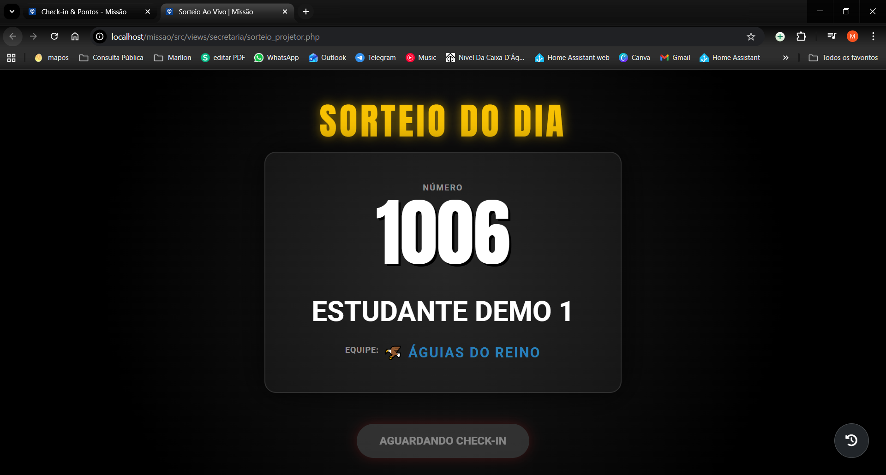
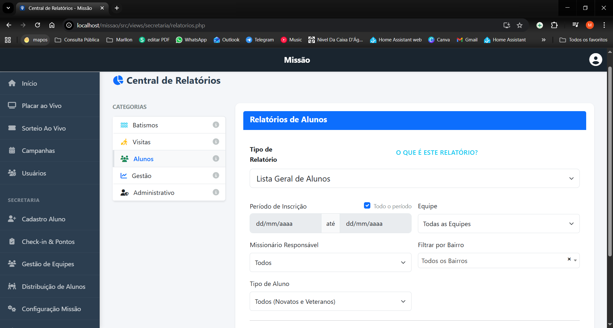

# ✅ Missão - Sistema de Gestão de Missões

O **Missão** é uma plataforma robusta projetada para gerenciar campanhas missionárias, organizar gincanas de equipes e acompanhar o crescimento espiritual de cada interessado. O sistema une a simplicidade necessária para o missionário em campo com o poder de dados que o administrador precisa.

---

## 📌 Sumário
- [🚀 Funcionalidades e Recursos](#-funcionalidades-e-recursos)
- [⚙️ Arquitetura e Modularidade](#️-arquitetura-e-modularidade)
- [📱 Tecnologia PWA & Offline](#-tecnologia-pwa--offline)
- [🎯 Módulo Campo (Missionário)](#-módulo-campo-missionário)
- [🏆 Gincana & Engajamento](#-gincana--engajamento)
- [📋 Módulo Secretaria](#-módulo-secretaria)
- [📊 Relatórios & BI](#-relatórios--inteligência-de-dados)
- [🛡️ Segurança & Administrativo](#-segurança--administrativo)
- [📦 Instalação](#-manual-de-instalação)

---

## 🚀 Funcionalidades e Recursos
O sistema oferece ferramentas completas divididas em módulos que funcionam em harmonia para garantir o sucesso do seu evento.

## ⚙️ Arquitetura e Modularidade
O coração do sistema é o conceito de **Campanhas**. Cada projeto (ex: "Missão Calebe", "Semana Santa") é independente e configurável.

> [!TIP]
> **Simples e Focado:** Se você desativar a gincana, o sistema "limpa" a tela para que o usuário veja apenas o que importa (as visitas e alunos), evitando distrações.

---

## 📱 Tecnologia PWA & Offline
Desenvolvido com tecnologia **Progressive Web App (PWA)**, o sistema garante que o missionário nunca pare de trabalhar:

- **Funciona sem Internet:** Registre visitas e atualize batismos mesmo em locais sem sinal. O sistema sincroniza tudo sozinho quando a internet voltar.
- **Instale como um App:** Não precisa baixar da Play Store ou App Store. Basta clicar em "Adicionar à tela inicial" e usar como um aplicativo nativo.
- **Leve e Rápido:** Otimizado para economizar bateria e dados móveis.

  
  &nbsp;&nbsp;
  

---

## 🎯 Módulo Campo (Missionário)
Interface pensada para o uso móvel e o trabalho "porta a porta":

- **Minhas Visitas (App):** Lista de alunos com sinalização de cores (Verde: Visitado / Amarelo: Atrasado / Vermelho: urgente).
- **Gestão de Batismos:** Atualize se o aluno é um Interessado, se já Agendou ou se foi Batizado com um toque.
- **Histórico de Estudos:** Acompanhe qual lição bíblica o aluno parou e veja observações de visitas anteriores.

---

## 🏆 Gincana & Engajamento
Ferramentas visuais poderosas para animar e motivar os participantes:

- **Placar ao Vivo:** Uma tela gigante (full-screen) para projetores que mostra quem está ganhando em tempo real. Sem menus, só a emoção do ranking.

- **Leilão de Prêmios:** Use os pontos acumulados ("Missão") para dar lances e ganhar prêmios reais. É o momento auge da gincana!
- **Sorteio Digital:** Substitua o papel por um sorteio visual vibrante na tela, garantindo transparência e animação.

---

## 📋 Módulo Secretaria
O controle administrativo total da campanha:

- **Organização de Equipes:** Ferramentas para criar equipes e distribuir missionários de forma justa.
- **Check-in & Presença:** Registro rápido de quem chegou no evento, alimentando automaticamente os pontos da gincana.
- **Distribuição de Interessados:** Envie novos nomes para os missionários de forma equilibrada através do mapa.

---

## 📊 Relatórios & Inteligência de Dados

O sistema conta com uma central de Business Intelligence (BI) com mais de 15 relatórios:

- **📈 Espiritual:** Funil de Conversão (Interessado ➔ Batizado), lista de agendamentos e metas de batismo.
- **👥 Faltas e Risco:** Identifica automaticamente quem está parando de vir ou quem não recebe visitas há muito tempo.
- **🚀 Performance:** Ranking detalhado, produtividade de cada missionário e evolução diária do projeto.
- **🛡️ Auditoria:** Controle de quem acessou o quê e registros de segurança maste.

---

## 🛡️ Segurança & Administrativo
Precisão técnica para garantir a integridade da sua operação:

- **Sensor de Ação:** Proteção que impede o salvamento de dados caso a campanha tenha sido encerrada ou a sessão tenha expirado.
- **Isolamento Multi-Tenant:** Cada cliente tem seus dados 100% isolados, garantindo privacidade total.
- **Backup em um Clique:** Gere uma cópia completa de toda a sua base de dados instantaneamente para segurança.

---

## 📦 Manual de Instalação

A instalação é guiada por um assistente web que verifica seu servidor automaticamente.

> [!IMPORTANT]
> Para detalhes técnicos como permissões de pasta, instalação do Composer e comandos SSH, leia o guia técnico:
> 
> 👉 **[Clique aqui para ler o INSTALL.md](INSTALL.md)**

---

### Suporte e Propriedade Intelectual
Este é um **software proprietário**. Todos os direitos são reservados. A distribuição não autorizada é proibida.

Copyright (c) 2025-2026 **Missão**.
